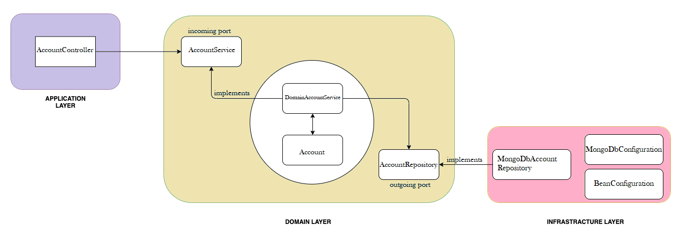

## Domain-driven Design (DDD)

This module contains Bank-Account implementation with Domain-driven Design (DDD)
In this example, we defined three main layers: application, domain, and infrastructure.
After that, we came up with the implementation for each layer.

